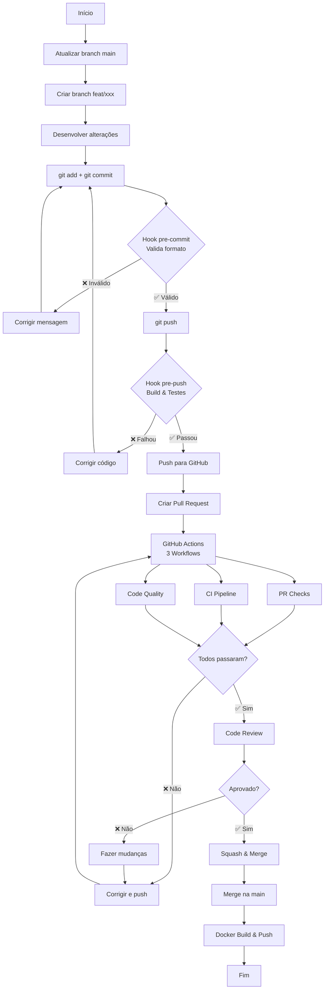
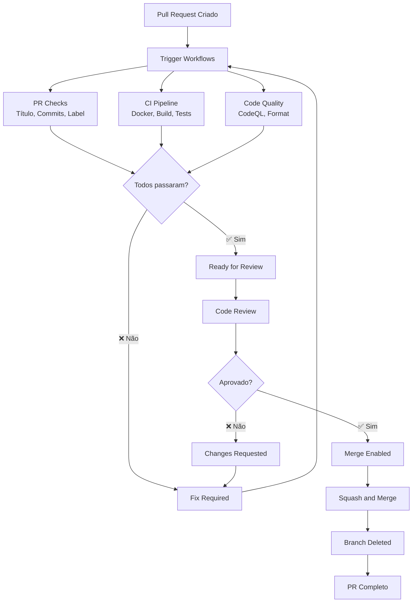
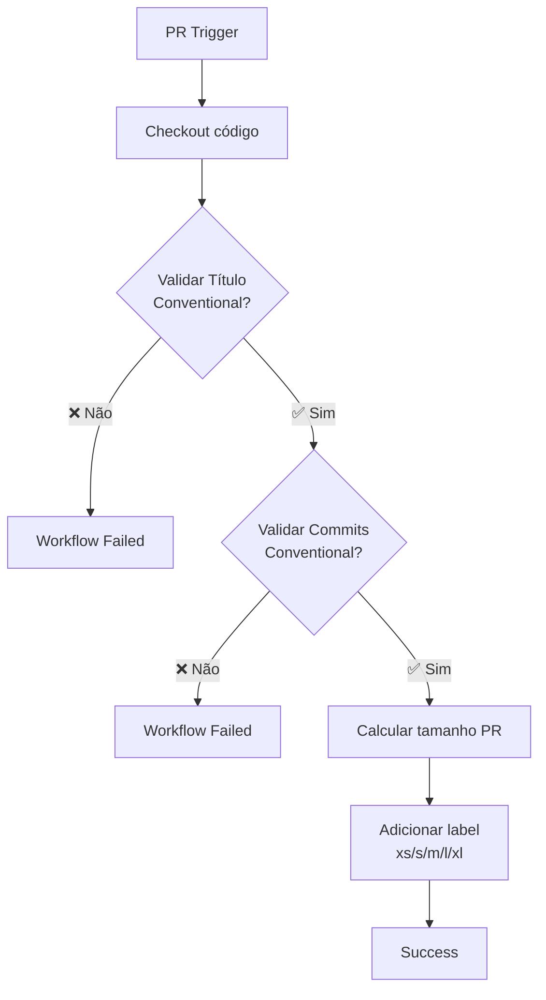
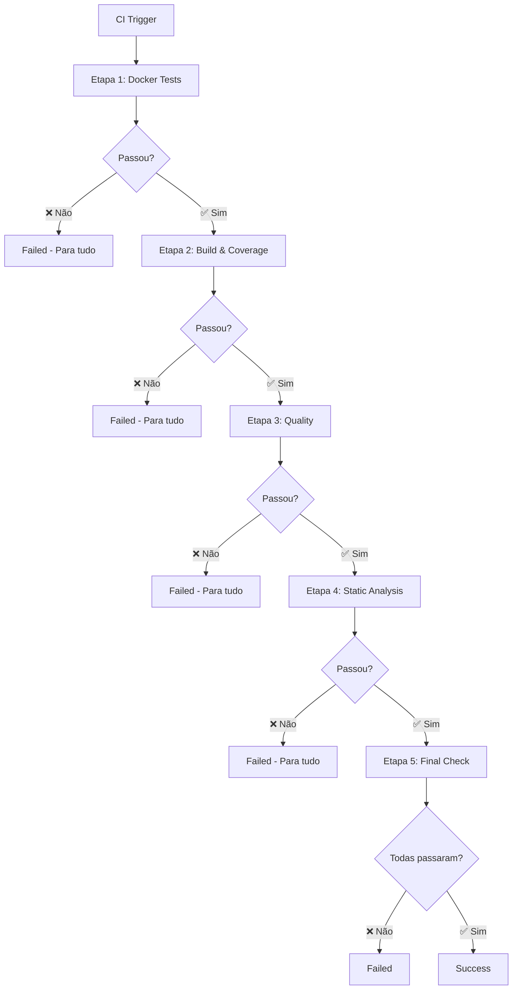
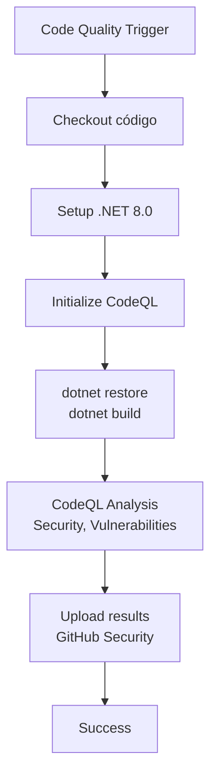
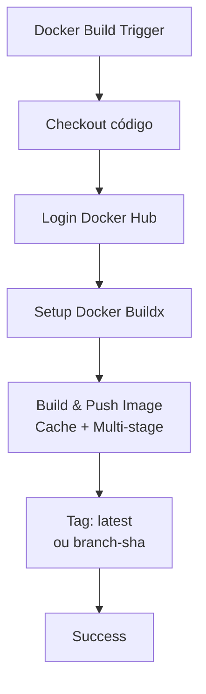
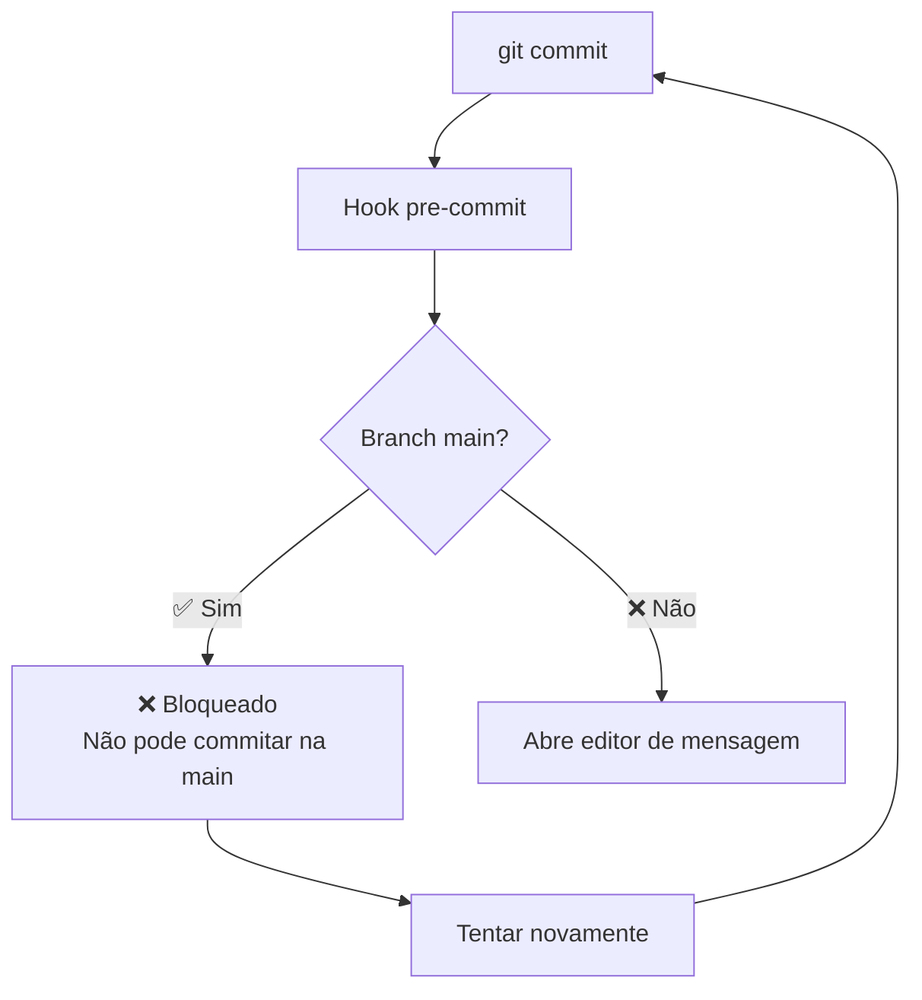
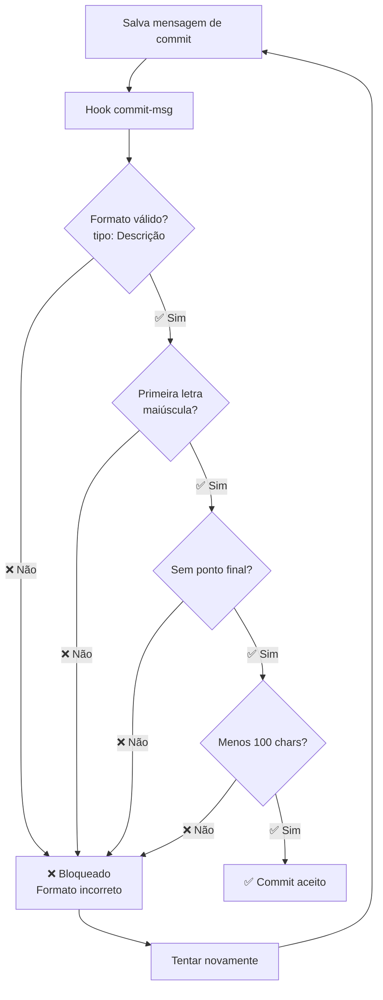
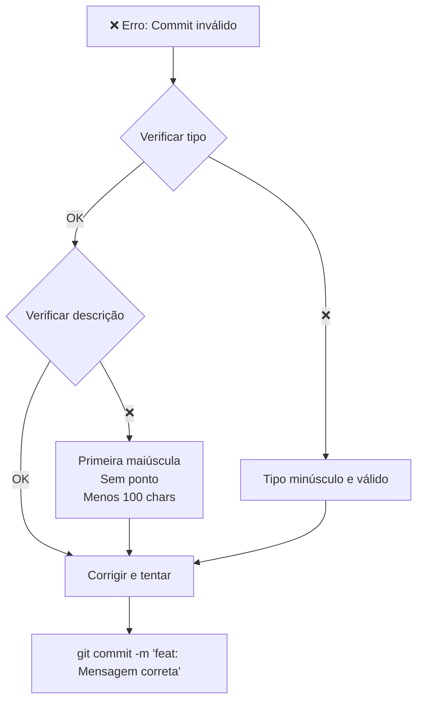
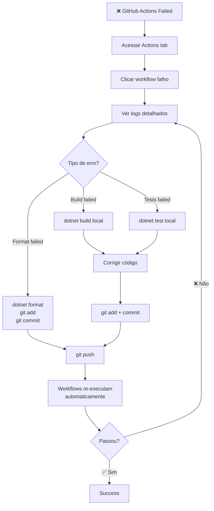

# 📊 Fluxogramas do CI

Visualização dos processos de CI do projeto usando Mermaid.

---

## 📋 Índice

- [Fluxo Completo de Contribuição](#fluxo-completo-de-contribuição)
- [Fluxo de Pull Request](#fluxo-de-pull-request)
- [Workflow: PR Checks](#workflow-pr-checks)
- [Workflow: CI Pipeline](#workflow-ci-pipeline)
- [Workflow: Code Quality](#workflow-code-quality)
- [Workflow: Docker Build](#workflow-docker-build)
- [Validação de Commits](#validação-de-commits)

---

## 🔄 Fluxo Completo de Contribuição

---

## 🔀 Fluxo de Pull Request

---

## ⚙️ Workflow: PR Checks

**Trigger:** Pull Request (opened/updated/reopened)

---

## 🔧 Workflow: CI Pipeline

**Trigger:** Pull Request ou Push para develop

---

## 🔍 Workflow: Code Quality

**Trigger:** Pull Request, Push, Schedule (weekly)

---

## 🐳 Workflow: Docker Build

**Trigger:** Push para main ou develop (após CI passar)

---

## 📝 Validação de Commits

**Formato:** `tipo(escopo): Descrição com primeira maiúscula`

### Pre-commit hook: bloqueio de commit na main

### Commit-msg hook: validação do formato da mensagem

---

## 🎯 Tipos de Commit Válidos

| Tipo | Descrição | Exemplo |
|------|-----------|---------|
| `feat` | Nova funcionalidade | `feat: Adicionar login social` |
| `fix` | Correção de bug | `fix: Resolver erro de timeout` |
| `docs` | Documentação | `docs: Atualizar README` |
| `style` | Formatação | `style: Corrigir indentação` |
| `refactor` | Refatoração | `refactor: Extrair método` |
| `perf` | Performance | `perf: Otimizar query SQL` |
| `test` | Testes | `test: Adicionar teste unitário` |
| `build` | Build system | `build: Atualizar dependências` |
| `ci` | CI/CD | `ci: Atualizar workflow` |
| `chore` | Manutenção | `chore: Limpar código morto` |
| `revert` | Reverter commit | `revert: Desfazer mudança X` |

---

## 🔍 Troubleshooting

### Commit Bloqueado

### Workflow Falhou

---

## 📚 Referências

Para mais detalhes, consulte:

- **[CONTRIBUTING.md](CONTRIBUTING.md)** - Guia completo de contribuição
- **[CI_README.md](CI_README.md)** - Overview do CI
- **[CI_QUICK_REFERENCE.md](CI_QUICK_REFERENCE.md)** - Comandos rápidos
- **[CI_WORKFLOW_GUIDE.md](CI_WORKFLOW_GUIDE.md)** - Detalhes dos workflows

---

**Última atualização:** Janeiro 2026  
**Versão:** 2.0
