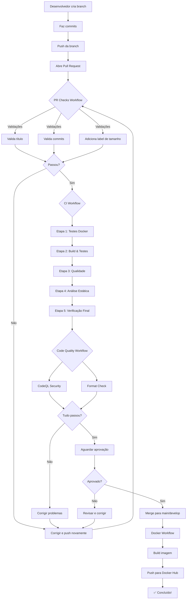

# 🚀 Guia Completo de CI - Prisma Prime Market API

## 📋 Índice

1. [Visão Geral](#visão-geral)
2. [Configuração do GitHub](#configuração-do-github)
3. [Fluxo de Trabalho](#fluxo-de-trabalho)
4. [Workflows Implementados](#workflows-implementados)
5. [Regras e Validações](#regras-e-validações)
6. [Como Trabalhar no Projeto](#como-trabalhar-no-projeto)

---

## 🎯 Visão Geral

Este projeto utiliza **Integração Contínua (CI)** com GitHub Actions para garantir qualidade e segurança do código. O pipeline é dividido em **4 workflows principais** que executam em momentos específicos.

### Princípios

- ✅ **Não é permitido push direto na branch `main`**
- ✅ Todas as mudanças devem passar por Pull Request
- ✅ PRs devem ser aprovados por pelo menos 1 revisor
- ✅ Todos os workflows devem passar antes do merge
- ✅ Build de imagem Docker apenas após merge em `main` ou `develop`

---

## 🔧 Configuração do GitHub

### 1. Habilitar GitHub Actions

1. Acesse o repositório no GitHub
2. Vá em **Settings** → **Actions** → **General**
3. Em **Actions permissions**, selecione:
   - ✅ **Allow all actions and reusable workflows**
4. Em **Workflow permissions**, selecione:
   - ✅ **Read and write permissions**
   - ✅ **Allow GitHub Actions to create and approve pull requests**
5. Clique em **Save**

---

### 2. Configurar Branch Protection (OBRIGATÓRIO)

#### Proteger branch `main`

1. Vá em **Settings** → **Branches**
2. Clique em **Add branch protection rule**
3. Em **Branch name pattern**, digite: `main`
4. Configure as seguintes opções:

**Require a pull request before merging:**
- ✅ Enabled
- **Require approvals**: 1 (ou mais, conforme sua equipe)
- ✅ **Dismiss stale pull request approvals when new commits are pushed**
- ✅ **Require review from Code Owners** (opcional)

**Require status checks to pass before merging:**
- ✅ Enabled
- ✅ **Require branches to be up to date before merging**
- **Status checks required** (adicione todos):
  - `validate-pr / Validar Título do PR`
  - `validate-pr / Validar Commits`
  - `build / Etapa 1: Testes em Docker`
  - `build / Etapa 2: Build & Testes com Cobertura`
  - `build / Etapa 3: Qualidade de Código`
  - `build / Etapa 4: Análise Estática`
  - `build / Etapa 5: Verificação Final`
  - `code-quality / CodeQL Analysis`

**Require conversation resolution before merging:**
- ✅ Enabled

**Do not allow bypassing the above settings:**
- ✅ Enabled

**Restrict who can push to matching branches:**
- ✅ Enabled
- **Adicione apenas usuários/times autorizados** (ou deixe vazio para bloquear todos)

5. Clique em **Create**

#### Proteger branch `develop` (Opcional, mas recomendado)

Repita o processo acima para a branch `develop`, mas com regras menos rígidas:
- Require approvals: 1
- Status checks: apenas os principais (build e testes)

---

### 3. Configurar Secrets do GitHub

#### Secrets Obrigatórios

1. Acesse **Settings** → **Secrets and variables** → **Actions**
2. Clique em **New repository secret**
3. Adicione os seguintes secrets:

**DOCKER_USERNAME:**
- Nome: `DOCKER_USERNAME`
- Value: Seu usuário do Docker Hub (ex: `joaosilva`)

**DOCKER_TOKEN:**
- Nome: `DOCKER_TOKEN`
- Value: Access Token do Docker Hub
- Como obter:
  1. Acesse https://hub.docker.com/
  2. Faça login
  3. Vá em **Account Settings** → **Security** → **Access Tokens**
  4. Clique em **New Access Token**
  5. Nome: "GitHub Actions CI"
  6. Permissions: **Read, Write, Delete**
  7. Copie o token (aparece apenas uma vez!)

**CODECOV_TOKEN (Opcional):**
- Nome: `CODECOV_TOKEN`
- Value: Token do Codecov (para cobertura de código)
- Como obter:
  1. Acesse https://codecov.io/
  2. Faça login com GitHub
  3. Adicione o repositório
  4. Copie o token de upload

---

### 4. Criar Labels do Repositório

Para o workflow de PR size labeling funcionar, crie as labels:

1. Vá em **Issues** → **Labels**
2. Crie as seguintes labels:

| Label | Cor | Descrição |
|-------|-----|-----------|
| `size/xs` | `#3CBF00` | Extra Small PR (< 10 linhas) |
| `size/s` | `#5D9801` | Small PR (< 100 linhas) |
| `size/m` | `#7F7203` | Medium PR (< 500 linhas) |
| `size/l` | `#A14C05` | Large PR (< 1000 linhas) |
| `size/xl` | `#C32607` | Extra Large PR (> 1000 linhas) |

Outras labels úteis:

| Label | Cor | Descrição |
|-------|-----|-----------|
| `feat` | `#0E8A16` | Nova funcionalidade |
| `fix` | `#D73A4A` | Correção de bug |
| `docs` | `#0075CA` | Documentação |
| `refactor` | `#FBCA04` | Refatoração |
| `test` | `#BFD4F2` | Testes |
| `ci` | `#000000` | CI/Workflows |
| `chore` | `#FEF2C0` | Manutenção |

---

## 🔄 Fluxo de Trabalho

### Como Funciona o Processo



---

## 📦 Workflows Implementados

### 1. PR Checks (`pr-checks.yml`)

**Quando executa:**
- ✅ Ao abrir um Pull Request
- ✅ Ao atualizar um Pull Request (novo push)
- ✅ Ao reabrir um Pull Request

**O que faz:**
- Valida se o título do PR segue Conventional Commits
- Valida se todos os commits seguem Conventional Commits
- Adiciona label automática de tamanho do PR

**Conventional Commits aceitos:**
- `feat:` - Nova funcionalidade
- `fix:` - Correção de bug
- `docs:` - Documentação
- `style:` - Formatação
- `refactor:` - Refatoração
- `perf:` - Performance
- `test:` - Testes
- `build:` - Build system
- `ci:` - CI/CD
- `chore:` - Manutenção

**Exemplos válidos:**
```
feat: adicionar endpoint de produtos
fix(auth): corrigir validação de JWT
docs: atualizar README
```

---

### 2. CI Pipeline (`ci.yml`)

**Quando executa:**
- ✅ Em Pull Requests para `main` ou `develop`
- ✅ Em push para `develop`
- ✅ Manualmente via workflow_dispatch

**Etapas (executam em sequência):**

#### Etapa 1: Testes em Docker
- Executa testes em ambiente isolado com Docker Compose
- Usa PostgreSQL real
- Upload de resultados de testes
- **Se falhar aqui, para tudo**

#### Etapa 2: Build & Testes com Cobertura
- Build nativo em .NET 8
- Testes unitários e de integração
- Coleta de cobertura de código
- Upload para Codecov
- **Só executa se Etapa 1 passar**

#### Etapa 3: Qualidade de Código
- Verificação de formatação (`dotnet format`)
- Scan de pacotes vulneráveis
- Scan de pacotes deprecados
- **Só executa se Etapa 2 passar**

#### Etapa 4: Análise Estática
- Roslyn Analyzers
- Análise de warnings
- **Só executa se Etapa 3 passar**

#### Etapa 5: Verificação Final
- Valida status de todas as etapas anteriores
- Gateway de segurança
- **Só executa se todas as etapas anteriores passarem**

#### Etapa 6 [FINAL]: Build & Push Docker (apenas em push para main/develop)
- Build da imagem Docker
- Push para Docker Hub com tags:
  - `latest` (branch main)
  - `develop` (branch develop)
  - `<branch>-<sha>` (identificação única)
- **Só executa se TODAS as etapas anteriores passarem E for push (não PR)**

---

### 3. Code Quality (`code-quality.yml`)

**Quando executa:**
- ✅ Em Pull Requests para `main` ou `develop`
- ✅ Em push para `main` ou `develop`
- ✅ Semanalmente (segundas-feiras às 9h UTC)
- ✅ Manualmente

**O que faz:**
- **CodeQL Analysis**: análise de segurança do código
- **Format Check**: verifica formatação do código
- **Code Metrics**: métricas de qualidade

---

### 4. Docker Build & Push (`docker-build.yml`)

**Quando executa:**
- ✅ Apenas em push para `main` ou `develop`
- ✅ Apenas se o CI Pipeline passar completamente
- ❌ **NÃO** executa em Pull Requests

**O que faz:**
- Build da imagem Docker otimizada
- Push para Docker Hub
- Cache de layers para builds rápidos

**Tags geradas:**
- Push para `main`: `latest`, `main`, `main-<sha>`
- Push para `develop`: `develop`, `develop-<sha>`

---

## ✅ Regras e Validações

### Regras de Branch

1. **Push direto na `main` é BLOQUEADO**
2. **Toda mudança deve passar por Pull Request**
3. **PR deve ser aprovado por pelo menos 1 revisor**
4. **Todos os workflows devem passar (status checks)**
5. **Branch deve estar atualizada com a main antes do merge**
6. **Conversas do PR devem estar resolvidas**

### Regras de Commit

1. **Deve seguir Conventional Commits**
2. **Formato**: `tipo(escopo): descrição`
3. **Escopo é opcional**
4. **Descrição deve ser clara e concisa**

**Exemplos:**
```bash
# ✅ CORRETO
git commit -m "feat: adicionar endpoint de produtos"
git commit -m "fix(auth): corrigir validação de token JWT"
git commit -m "docs: atualizar guia de CI"
git commit -m "test(orders): adicionar testes de integração"

# ❌ ERRADO
git commit -m "adicionei nova feature"
git commit -m "bug fix"
git commit -m "WIP"
```

### Regras de Pull Request

1. **Título deve seguir Conventional Commits**
2. **Descrição deve explicar as mudanças**
3. **Deve referenciar issues relacionadas** (se aplicável)
4. **Deve ter tamanho razoável** (evite PRs gigantes)
5. **Deve ter testes para novas funcionalidades**

**Exemplo de título:**
```
feat: implementar autenticação JWT
fix: resolver cálculo incorreto de frete
docs: adicionar documentação de API
```

### Status Checks Obrigatórios

Antes do merge, todos estes checks devem passar:

- ✅ Validação de título do PR
- ✅ Validação de commits
- ✅ Etapa 1: Testes em Docker
- ✅ Etapa 2: Build & Testes com Cobertura
- ✅ Etapa 3: Qualidade de Código
- ✅ Etapa 4: Análise Estática
- ✅ Etapa 5: Verificação Final
- ✅ CodeQL Analysis
- ✅ Aprovação de revisor

---

## 👨‍💻 Como Trabalhar no Projeto

### 1. Criar uma nova feature

```bash
# Atualizar sua branch local
git checkout main
git pull origin main

# Criar nova branch
git checkout -b feat/nome-da-feature

# Fazer suas alterações
# ...

# Commit seguindo Conventional Commits
git add .
git commit -m "feat: adicionar funcionalidade X"

# Push da branch
git push origin feat/nome-da-feature
```

### 2. Abrir Pull Request

1. Acesse o repositório no GitHub
2. Clique em **Pull requests** → **New pull request**
3. Selecione sua branch
4. Preencha:
   - **Título**: seguindo Conventional Commits (ex: `feat: adicionar funcionalidade X`)
   - **Descrição**: explique as mudanças, adicione screenshots se necessário
   - **Reviewers**: adicione revisores
   - **Labels**: adicione labels relevantes (feat, fix, etc)
5. Clique em **Create pull request**

### 3. Aguardar validações

- Os workflows serão executados automaticamente
- Você pode acompanhar o progresso na aba **Checks** do PR
- Se algum workflow falhar, corrija o problema e faça novo push

### 4. Correções durante o PR

```bash
# Fazer correções
# ...

# Commit
git add .
git commit -m "fix: corrigir problema X"

# Push (os workflows rodam novamente automaticamente)
git push origin feat/nome-da-feature
```

### 5. Após aprovação

- Aguarde a aprovação de pelo menos 1 revisor
- Certifique-se de que todos os workflows passaram
- Resolva todas as conversas pendentes
- Clique em **Merge pull request**
- Escolha **Squash and merge** (recomendado) ou **Merge commit**
- Delete a branch após o merge

### 6. Após merge na main

- O workflow de Docker será executado automaticamente
- A imagem Docker será construída e enviada para o Docker Hub
- Você pode verificar em **Actions** → **Docker Build & Push**

---

## 🧪 Testando Localmente

### Antes de fazer push

```bash
# Verificar formatação
dotnet format --verify-no-changes

# Corrigir formatação automaticamente
dotnet format

# Build
dotnet build

# Rodar todos os testes
dotnet test

# Rodar testes com cobertura
dotnet test --collect:"XPlat Code Coverage"

# Verificar pacotes vulneráveis
dotnet list package --vulnerable --include-transitive

# Verificar pacotes deprecados
dotnet list package --deprecated --include-transitive
```

### Simular workflows localmente

Use o [Act](https://github.com/nektos/act) para simular GitHub Actions:

```bash
# Instalar Act
# Windows: choco install act-cli
# Mac: brew install act
# Linux: curl https://raw.githubusercontent.com/nektos/act/master/install.sh | sudo bash

# Testar workflow de PR
act pull_request

# Testar workflow de CI
act push -j build

# Testar workflow específico
act -W .github/workflows/ci.yml
```

---

## 📊 Monitoramento

### Verificar status dos workflows

1. Acesse a aba **Actions** no GitHub
2. Veja o histórico de execuções
3. Clique em uma execução para ver detalhes
4. Expanda os jobs para ver logs

### Badges para README

Adicione badges ao README.md para mostrar o status:

```markdown
[](https://github.com/seu-usuario/PrismaPrimeMarketAPI/actions/workflows/ci.yml)
[](https://github.com/seu-usuario/PrismaPrimeMarketAPI/actions/workflows/pr-checks.yml)
[](https://github.com/seu-usuario/PrismaPrimeMarketAPI/actions/workflows/code-quality.yml)
```

---

## 🚨 Troubleshooting

### Workflow falhou - O que fazer?

1. **Leia o log de erro**
   - Clique no workflow que falhou
   - Expanda o step que falhou
   - Leia a mensagem de erro

2. **Problemas comuns:**

**"Build failed - project not found"**
- Verifique se todos os projetos .NET estão criados
- Verifique se o caminho está correto

**"Tests failed"**
- Rode os testes localmente: `dotnet test`
- Corrija os testes que falharam
- Faça novo commit e push

**"Format check failed"**
- Execute: `dotnet format`
- Commit as mudanças
- Faça novo push

**"Conventional commits failed"**
- Certifique-se de usar o formato correto: `tipo: descrição`
- Tipos válidos: feat, fix, docs, style, refactor, perf, test, build, ci, chore

**"Docker build failed"**
- Verifique se o Dockerfile existe
- Verifique se os secrets estão configurados (DOCKER_USERNAME, DOCKER_TOKEN)
- Teste o build localmente: `docker build -t test .`

**"Status check not found"**
- Verifique se o workflow existe em `.github/workflows/`
- Certifique-se de que o nome do check na branch protection está correto

### Como desbloquear um PR

Se você estiver bloqueado e precisar fazer merge urgente (APENAS EM EMERGÊNCIAS):

1. Um administrador pode ir em **Settings** → **Branches**
2. Editar a regra de proteção
3. Desmarcar temporariamente as opções
4. Fazer o merge
5. **IMPORTANTE**: Re-habilitar as proteções imediatamente após

---

## 📚 Recursos

- [GitHub Actions Documentation](https://docs.github.com/actions)
- [Conventional Commits](https://www.conventionalcommits.org/)
- [Docker Hub](https://hub.docker.com/)
- [Codecov](https://codecov.io/)
- [Act - Local GitHub Actions](https://github.com/nektos/act)

---

**Última atualização:** Janeiro 2026  
**Versão:** 1.0
