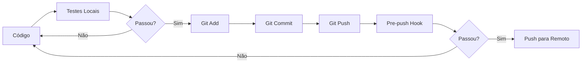

# 🧪 Guia de Testes Automatizados

Este documento descreve como configurar e usar testes automatizados antes de commits e pushes.

## 📋 Índice

- [Git Hooks](#git-hooks)
- [Docker Compose](#docker-compose)
- [Scripts de Validação](#scripts-de-validação)
- [GitHub Actions](#github-actions)

---

## 🎣 Git Hooks

### O que são Git Hooks?

Git hooks são scripts que são executados automaticamente em determinados eventos do Git (commit, push, etc.).

### Configuração (Recomendado)

**1. Configurar o diretório de hooks customizado:**

```bash
# No Windows (PowerShell)
git config core.hooksPath .githooks

# No Linux/Mac
chmod +x .githooks/pre-push
git config core.hooksPath .githooks
```

**2. Pronto!** Agora, toda vez que você fizer `git push`, os testes serão executados automaticamente.

### Como funciona?

- Antes de cada push, o hook `.githooks/pre-push` é executado
- Se os testes passarem (exit code 0), o push continua
- Se os testes falharem (exit code != 0), o push é **bloqueado**

### Desabilitar temporariamente

```bash
# Pular o hook em um push específico
git push --no-verify
```

---

## 🐳 Docker Compose

### Pré-requisitos

- Docker Desktop instalado
- Docker Compose

### Executar testes com Docker

**Opção 1: Script automatizado (Windows)**
```powershell
.\scripts\test-docker.bat
```

**Opção 2: Comando direto**
```bash
docker-compose -f docker-compose.test.yml up --build --abort-on-container-exit

# Limpar depois
docker-compose -f docker-compose.test.yml down -v
```

### Vantagens

✅ Ambiente isolado e limpo  
✅ PostgreSQL real para testes de integração  
✅ Mesmos resultados em qualquer máquina  
✅ Simula CI/CD localmente

---

## 📝 Scripts de Validação

### Validação completa

**Windows:**
```powershell
.\scripts\validate.bat
```

**Linux/Mac:**
```bash
chmod +x scripts/validate.sh
./scripts/validate.sh
```

### O que é validado?

1. ✅ Restore de pacotes
2. ✅ Build da solução
3. ✅ Execução de todos os testes
4. ⚠️ Formatação de código (warning apenas)

---

## 🔄 GitHub Actions (CI/CD)

### Arquivo de workflow (`.github/workflows/ci.yml`)

```yaml
name: CI

on:
  push:
    branches: [ main, develop ]
  pull_request:
    branches: [ main, develop ]

jobs:
  test:
    runs-on: ubuntu-latest
    
    services:
      postgres:
        image: postgres:16-alpine
        env:
          POSTGRES_USER: postgres
          POSTGRES_PASSWORD: postgres
          POSTGRES_DB: PrismaPrimeMarketDB_Test
        options: >-
          --health-cmd pg_isready
          --health-interval 10s
          --health-timeout 5s
          --health-retries 5
        ports:
          - 5432:5432

    steps:
    - uses: actions/checkout@v3
    
    - name: Setup .NET
      uses: actions/setup-dotnet@v3
      with:
        dotnet-version: 8.0.x
    
    - name: Restore dependencies
      run: dotnet restore
    
    - name: Build
      run: dotnet build --no-restore
    
    - name: Test
      run: dotnet test --no-build --verbosity normal
      env:
        ConnectionStrings__DefaultConnection: "Host=localhost;Port=5432;Database=PrismaPrimeMarketDB_Test;Username=postgres;Password=postgres"
```

---

## 🎯 Fluxo de Trabalho Recomendado

### Desenvolvimento Local



### Comandos

```bash
# 1. Desenvolvimento
# ... fazer alterações no código ...

# 2. Validar localmente (opcional mas recomendado)
./scripts/validate.bat

# 3. Commit
git add .
git commit -m "feat: nova funcionalidade"

# 4. Push (testes rodam automaticamente)
git push origin main
```

---

## 🚀 Quick Start

### Setup completo em 3 passos:

**1. Configurar Git Hooks**
```bash
git config core.hooksPath .githooks
```

**2. Testar a configuração**
```bash
.\scripts\validate.bat
```

**3. Fazer um push de teste**
```bash
git push
# Os testes rodarão automaticamente!
```

---

## ⚙️ Configurações Avançadas

### Personalizar o hook

Edite `.githooks/pre-push.bat` para adicionar validações customizadas:

```batch
REM Adicionar lint
dotnet format --verify-no-changes
if %ERRORLEVEL% neq 0 exit /b 1

REM Adicionar análise de segurança
dotnet list package --vulnerable
```

### Executar apenas testes rápidos

Para não esperar testes de integração durante o push:

```bash
# .githooks/pre-push.bat
dotnet test --filter "Category!=Integration"
```

---

## 📊 Relatórios de Teste

### Gerar relatório HTML

```bash
dotnet test --logger "html;logfilename=testresults.html"
```

### Gerar relatório com cobertura

```bash
dotnet test --collect:"XPlat Code Coverage"
```

---

## 🐛 Troubleshooting

### Hook não está executando

```bash
# Verificar configuração
git config core.hooksPath

# Deve retornar: .githooks

# Reconfigurar se necessário
git config core.hooksPath .githooks
```

### Docker não encontra PostgreSQL

```bash
# Verificar se o serviço está rodando
docker ps

# Verificar logs
docker-compose -f docker-compose.test.yml logs postgres
```

### Testes falhando no Docker mas passando local

- Verificar variáveis de ambiente
- Verificar connection strings
- Verificar permissões de arquivo

---

## 📚 Recursos Adicionais

- [Git Hooks Documentation](https://git-scm.com/book/en/v2/Customizing-Git-Git-Hooks)
- [Docker Compose Documentation](https://docs.docker.com/compose/)
- [xUnit Documentation](https://xunit.net/)
- [GitHub Actions Documentation](https://docs.github.com/en/actions)

---

## 💡 Dicas

- ✅ Execute `./scripts/validate.bat` antes de fazer commit
- ✅ Use `--no-verify` apenas em emergências
- ✅ Mantenha os testes rápidos (< 30 segundos)
- ✅ Use Docker para garantir consistência
- ✅ Configure CI/CD no GitHub/GitLab

---

**Última atualização:** Janeiro 2026
